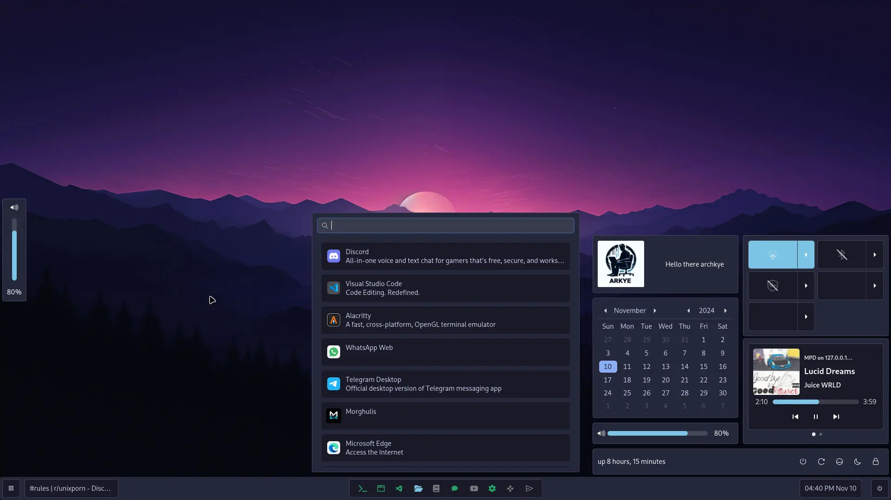

# Archkye's dotfiles

Used here:

- [Morghulis](https://github.com/ARKye03/morghulis).
- [Hyprland](https://hyprland.org/).
- [Alacritty](https://alacritty.org/), [Kitty](https://sw.kovidgoyal.net/kitty/).
- [Hyprlock](https://github.com/hyprwm/hyprlock), [hyprpicker](https://github.com/hyprwm/hyprpicker), [hypridle](https://github.com/hyprwm/hypridle)
- [Music Player Daemon](https://musicpd.org/) + [ncmpcpp](https://github.com/ncmpcpp/ncmpcpp) & [mpd-mpris](https://github.com/natsukagami/mpd-mpris).
- Wallpaper utility: [wbg](https://codeberg.org/dnkl/wbg).
- Clipboard manager: [CopyQ](https://github.com/hluk/CopyQ).
- Notification Daemon: [Mako](https://github.com/emersion/mako).
- [Zsh](https://www.zsh.org/), [ble.sh(Bash)](https://github.com/akinomyoga/ble.sh).
- Theme: Adwaita + adw-gtk
- Cursor: [Bibata](https://github.com/rtgiskard/bibata_cursor).
- [GNU Stow](https://www.gnu.org/software/stow/)
- [Lua](https://lua.org/)

> [!NOTE]
> There is a working config of [AGS](https://github.com/Aylur/ags) available



## Usage

Install GNU Stow, dependencies and clone the repo

- All the pkgs that I have installed are [these](public/installedPKGS/README.md).
  
```sh
git clone https://github.com/ARKye03/HyprDots.git
cd HyprDots
stow . --dotfiles
```

Have in mind that if stow finds a file that already exists, it will not overwrite it.
