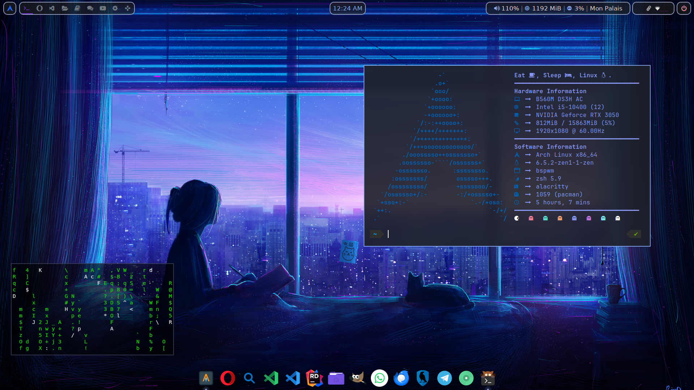

# .files

## Arch

>- BSPWM
>
>- ROFI
>
>- POLYBAR

[BSPWM + ArchLinux](https://github.com/ARKye03/dotfiles/tree/BSPArch)

## HyprArch

>- Hyprland
>
>- ROFI
>
>- AGS

[Hyprland + ArchLinux](https://github.com/ARKye03/dotfiles/tree/HyprArch)

## Archcraft

[ArchCraft](https://github.com/ARKye03/dotfiles/tree/ArchCraft)

Simple personal files for me.

